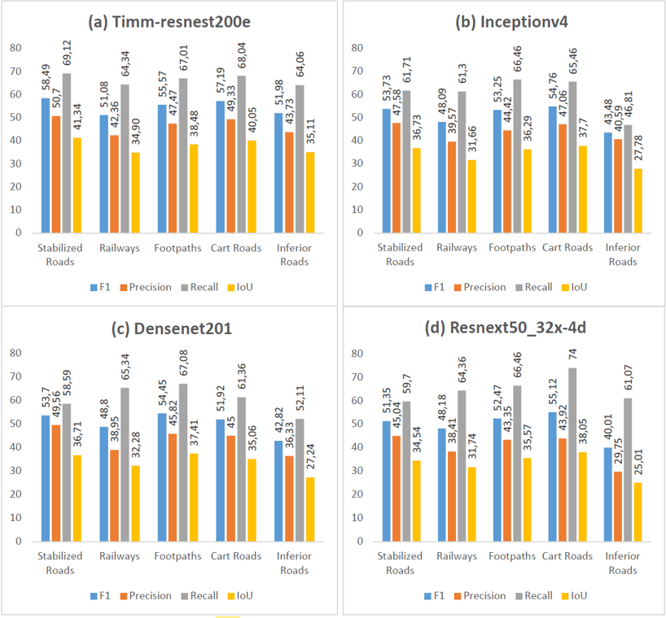
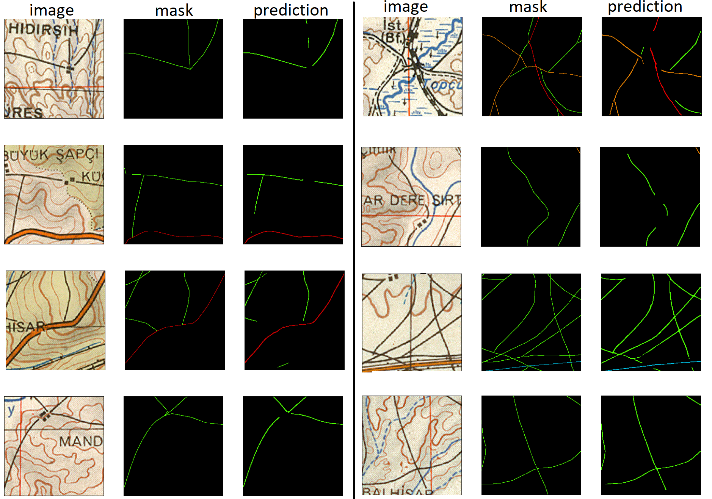

# Deep Learning based road extraction from historical maps 
This repository contains the code for the paper [Deep Learning based road extraction from historical maps]

Dataset (Source)
---------------------
[Turkey 1:200k Historical Topographic Maps](http://digitalarchive.mcmaster.ca/islandora/object/macrepo%3A82339)

The historical DHK 200 Turkey map used in this study covers a large area of around
150,000 square km in northwest Turkey, including the regions of Ankara and Bursa.
The DHK 200 Turkey map legends are organized bilingually in accordance with the rest of the World War II German military
maps [1].

| Model              | No of Parameters | F-1 Score | Weights |
|:--------------------------:|:------------------:|-------------------------:|-------------------------:|
|Timm-resnest200e                         | 8 Batch-Size                | **0,564**                      | [Timm-resnest200e.pth](https://drive.google.com/drive/u/0/folders/1zQfCouyg3uVd76KNzYpbvrFJ4DGfUPdp)                   |
|Inceptionv4                         | 16 Batch-Size                 | 0,525                      | [Inceptionv4.pth](https://drive.google.com/drive/u/0/folders/1zQfCouyg3uVd76KNzYpbvrFJ4DGfUPdp)                 |
|Densenet201                         | 16 Batch-Size                 | 0,511                     | [Densenet201.pth](https://drive.google.com/drive/u/0/folders/1zQfCouyg3uVd76KNzYpbvrFJ4DGfUPdp)   
|Resnext50_32x4d                         | 16 Batch-Size                | 0,491                     | [Resnext50_32x4d.pth](https://drive.google.com/drive/u/0/folders/1zQfCouyg3uVd76KNzYpbvrFJ4DGfUPdp)  

Framework
---------------------

Weights for Inference 
---------------------
[Drive Link](https://drive.google.com/drive/u/0/folders/1zQfCouyg3uVd76KNzYpbvrFJ4DGfUPdp)

Models Comparison
---------------------

Outputs
---------------------

Prequsities
---------------------

The code was implemented in Python(3.8) and PyTroch(1.14.0) on Windows OS. The *Qubvel segmentation models pytorch* library is used as a baseline for implementation. 
Apart from main data science libraries, RS-specific libraries such as GDAL, rasterio, and tifffile are also required.

Citation
---------------------

[1] Ekim, B., Sertel, E., & Kabadayı, M. E. (2021). Automatic Road Extraction from Historical Maps Using Deep Learning Techniques: A Regional Case Study of Turkey in a German World War II Map. ISPRS International Journal of Geo-Information, 10(8), 492.

[2]qubvel/segmentation_models.pytorch: Segmentation models with pretrained backbones. PyTorch

Contact Information:
--------------------
Cengiz Avcı - avcice16@itu.edu.tr 
